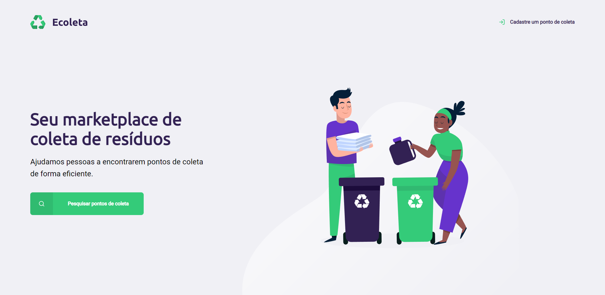
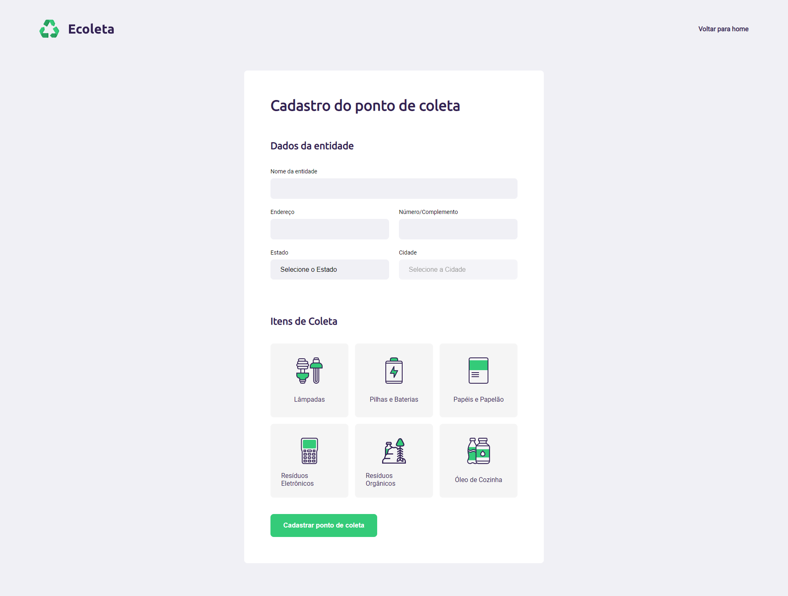
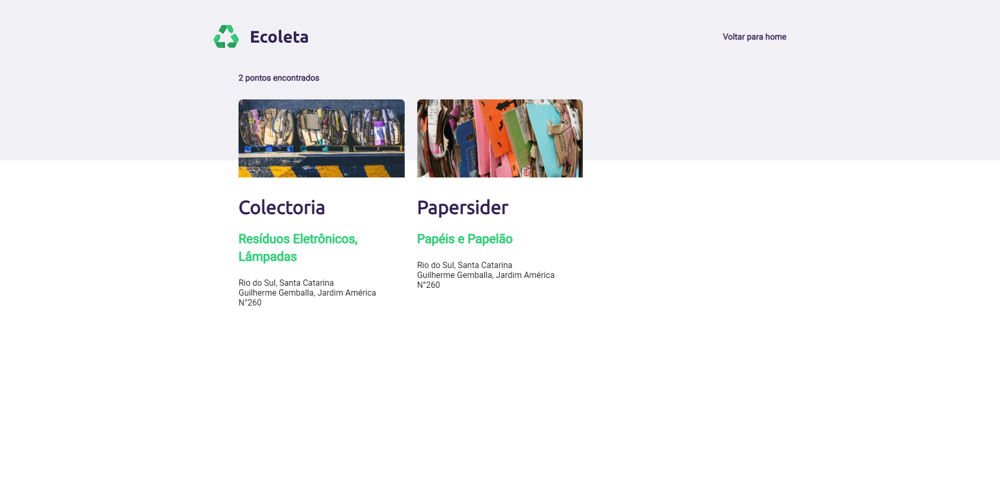

<h1 align="center">
    
</h1>

<h1 align="center">
    
</h1>

<h1>
    

<h1>
    

<h1>
    


## 🔖 Sobre

O projeto **Ecoleta** é um marketplace de coleta de resíduos. Projeto criado na semana **Next Week Level**.


## 🚀 Tecnologias utilizadas

O projeto foi desenvolvido utilizando as seguintes tecnologias

- [CSS](https://developer.mozilla.org/pt-BR/docs/Web/CSS)
- [Express](https://expressjs.com/pt-br/)
- [HTML](https://developer.mozilla.org/pt-BR/docs/Web/HTML)
- [JavaScript](https://www.javascript.com/)
- [Nodejs](https://nodejs.org/en/)
- [NPM](https://www.npmjs.com/)
- [Sqlite](https://www.sqlite.org/index.html)

## 🗂 Como baixar e iniciar o projeto

```bash

    # Clonar o repositório
    $ git clone https://github.com/RodrigoFonsecaG/ecoleta.git

    # Entrar no diretório
    $ cd ecoleta

    # Instale as dependências
    $ npm install
    
    # Iniciar o projeto
    $ npm start
```
